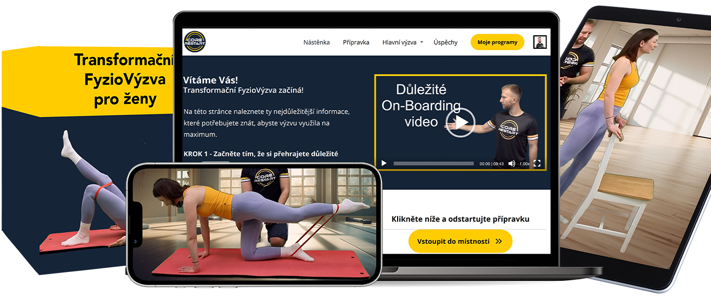

# CoreRestart Live – Claude Code Notes

## Zvukové notifikace

Po dokončení každého úkolu přehraj zvuk pomocí PowerShellu:
```bash
powershell -c "[console]::beep(880,200); [console]::beep(1100,300)"
```

## Testing – Playwright

Playwright is installed and configured in this project.

Installation date: April 9, 2026
Test result at installation: 12/12 passed (4 tests × 3 browsers)

### Browsers tested:
- Chromium
- Firefox
- WebKit (Safari)

### Test files:
- `tests/corerestart.spec.js` – hlavní test file (4 testy: homepage, form, livestream, no-timeline)
- `tests/exkluzivni-nabidka.spec.js` – testy pro exkluzivni-nabidka.html (9 testů)
- `tests/visual-check.spec.js` – vizuální screenshoty dechovy-vikend-pro-seniory + dekujeme-za-registraci-dech
- `tests/screenshots/` – automatické screenshoty z každého spuštění

### Pozor: fade-up animace ve full-page screenshotech
`.fade-up` + IntersectionObserver se spouští pouze při skutečném scrollu v prohlížeči.
Ve full-page Playwright screenshotech proto sekce uprostřed stránky vypadají prázdně (opacity: 0).
Toto je správné chování — v prohlížeči se vše zobrazí při scrollu. Není to bug.

### Test history:
| Datum | Soubor | Výsledek |
|---|---|---|
| 9. dubna 2026 | `corerestart.spec.js` | 12/12 passed (4 testy × 3 prohlížeče) |
| 19. dubna 2026 | `exkluzivni-nabidka.spec.js` | 27/27 passed (9 testů × 3 prohlížeče) |

### How to run tests:
- Headless mode (background, no visible browser):
  `npm test`
- Headed mode (visible browser windows):
  `npm run test:headed`
- Konkrétní soubor:
  `npx playwright test tests/exkluzivni-nabidka.spec.js`

### When to run tests:
Vždy spustit testy po změnách v HTML souborech před deplojem na Vercel:
- `index.html` → `corerestart.spec.js`
- `vysílání-1.html` → `corerestart.spec.js`
- `exkluzivni-nabidka.html` → `exkluzivni-nabidka.spec.js`

### Note on headless mode:
By default Playwright runs in headless mode - browsers run in background
without visible windows. This is normal and correct behavior.
To see browsers visually, use: `npm run test:headed`

---

## Přehled projektu

Webová aplikace která simuluje živé vysílání předtočeného videa uloženého na AWS S3.
Zákazníci dostanou odkaz, přijdou na stránku, uvidí odpočet do začátku vysílání,
a v přesný čas se jim spustí video – bez možnosti posouvat časovou osu.
V průběhu vysílání se zobrazí CTA tlačítko vedoucí na prodejní stránku.
Po skončení videa se zobrazí stránka "Vysílání skončilo" s tlačítkem na záznam.

---

## Tech Stack

| Vrstva | Technologie |
|---|---|
| Frontend | Vanilla HTML + CSS + JavaScript (žádný framework) |
| Hosting | Vercel |
| Video | AWS S3 (přímá URL) |

**DŮLEŽITÉ: Tento projekt NEPOUŽÍVÁ Next.js, React ani npm.**
Je to čisté HTML/CSS/JS – žádné závislosti, žádný build process.

---

## Klíčové URL a konfigurace

- **Live URL:** https://corerestart-live.vercel.app
- **Prodejní stránka (CTA):** https://corerestart.cz/
- **Záznam vysílání:** https://mamacore.cz/
- **VIDEO_URL:** prázdná – doplnit před každým vysíláním (viz níže)
- **CTA se zobrazí po:** 1800 sekundách (= 30 minutách) od startu videa

---

## Aktuální struktura projektu

```
CoreRestart-Live/
├── index.html                        – homepage (coming soon, corerestart.live/)
├── dekovaci-hlavni.html              – děkovací stránka po registraci SmartEmailing (corerestart.live/dekujeme-za-registraci)
├── exkluzivni-nabidka.html           – nabídka 5 výzev pro FyzioKlub (corerestart.live/exkluzivni-nabidka)
├── landing-page-dech-senior.html     – landing page Dechového víkendu (corerestart.live/dechovy-vikend-pro-seniory)
├── dekovaci-dech-senior.html         – děkovací + upsell stránka po registraci na Dechový víkend (corerestart.live/dekujeme-za-registraci-dech)
├── dekovaci-vip-vstup-dech-senior.html – děkovací stránka po zakoupení VIP vstupenky (corerestart.live/dekujeme-za-objednavku-vip-vstupenky)
├── nastenka-dech-senior.html         – nástěnka víkendu s programem, VIP modalem, referencemi (corerestart.live/nastenka-dechovy-vikend)
├── vysílání-1.html                   – fake livestream player (corerestart.live/vysilani-1)
├── styles.css                        – CSS pro vysílání-1.html
├── script.js                         – JS pro vysílání-1.html
├── vercel.json                       – konfigurace Vercel + routy
├── CLAUDE.md                         – tento soubor s instrukcemi
├── .gitignore
├── image/
│   ├── Logo-stredni.png                         – kulaté logo CoreRestart
│   ├── My dva nové.png                          – fotka Filipa a Tomáše
│   ├── img-dech-senior/
│   │   ├── svaly.jpg                            – diagram svalů (sekce "věda za metodou")
│   │   └── reference/                           – screenshoty FB referencí (10 klientů)
│   │       ├── dada.png, gabriela.png, hana.png, ivca.png, jana.jpg
│   │       ├── jolanta.png, katerina.png, lenka.png, marta.png, michaela.png
│   └── img-exkluzivni-nabidka/                  – produktové obrázky pro exkluzivni-nabidka.html
│       ├── fyziovyzva-transformacni.png
│       ├── fyziovyzva-krcni-pater.png
│       ├── fyziovyzva-seniory.png
│       └── fyzioyoga-30-30.png
├── .claude/
└── .vercel/
```

---

## Jak aktualizovat datum a čas vysílání

Před každým novým vysíláním napiš Claude Code:
```
Update the stream start time in vysílání-1.html to [DATUM] at [ČAS] CEST
(= [ČAS - 2 hodiny] in UTC) and redeploy to Vercel with: npx vercel --prod
```
**Důležité:** CEST = UTC + 2 hodiny. Vždy odečti 2 hodiny pro UTC.
Příklad: 20:00 CEST = 18:00 UTC → `2026-04-03T18:00:00Z`

---

## Jak aktualizovat URL videa

Video URL je záměrně prázdná z bezpečnostních důvodů. Před každým vysíláním napiš Claude Code:
```
Update VIDEO_URL in vysílání-1.html to: [URL VIDEA]
Then redeploy to Vercel with: npx vercel --prod
```
Po skončení vysílání URL opět smazat:
```
Remove the VIDEO_URL from vysílání-1.html (set it to empty string "")
and redeploy to Vercel with: npx vercel --prod
```

---

## Jak nasadit na Vercel

```bash
npx vercel --prod
```
Spustit v terminálu ve složce projektu `C:/projekty/corerestart-live`.

---

## Known Issues & Fixes

### 1. Produktové obrázky se nezobrazovaly (exkluzivni-nabidka.html)
**Problém:** Obrázky na stránce `/exkluzivni-nabidka` se nezobrazovaly — byl vidět pouze alt text a číslo bloku.
**Příčina 1 – diakritika v názvu souboru:** Původní soubory měly v názvu česká písmena (`Transformační FyzioVýzva.png`). Vercel neumí spolehlivě servovat soubory s diakritikou v cestě.
**Příčina 2 – relativní vs. absolutní cesta (hlavní příčina):** Src obrázků bylo relativní (`image/...`). Při přístupu na stránku s trailing slash (`/exkluzivni-nabidka/`) prohlížeč resolvuje relativní cestu jako `/exkluzivni-nabidka/image/...`, což neexistuje.
**Řešení:**
1. Soubory přejmenovány na ASCII-only názvy bez diakritiky a mezer:
   - `fyziovyzva-transformacni.png`, `fyziovyzva-krcni-pater.png`, `fyziovyzva-seniory.png`, `fyzioyoga-30-30.png`
2. Všechny `src` atributy změněny na absolutní cestu začínající `/`:
   ```html
   <!-- špatně -->
   
   <!-- správně -->
   
   ```
**Pravidlo do budoucna:** Vždy používat absolutní cesty (`/image/...`) pro obrázky a assety — fungují bez ohledu na trailing slash v URL.

---

### 2. Video starts muted (autoplay browser restriction)
**Problém:** Když odpočet doběhne a video se spustí automaticky, zvuk je ztlumený.
**Důvod:** Všechny moderní prohlížeče (Chrome, Firefox, Safari) blokují autoplay
se zvukem. Toto NELZE obejít – je to bezpečnostní funkce prohlížeče.
**Řešení:** Zobrazit velké výrazné tlačítko "▶ Spustit vysílání" když odpočet skončí.
Video se spustí se zvukem po kliknutí na toto tlačítko.
Jedno kliknutí je nevyhnutelné – nelze se tomu vyhnout.

### 2. Časová osa viditelná
**Problém:** HTML5 video přehrávač zobrazuje timeline – diváci vidí délku videa
a mohou přeskakovat na libovolnou pozici. Na fake livestreamu to nesmí být vidět.
**Důvod selhání CSS:** Webkit pseudo-elementy (`video::-webkit-media-controls-timeline`)
fungují pouze v Chrome – ve Firefoxu nefungují.
**Správné řešení:** Odebrat nativní `controls` atribut z `<video>` úplně a postavit
vlastní ovládací prvky v JS/CSS.
**Implementováno:** Vlastní control bar obsahuje pouze:
- ▶/⏸ play/pause vlevo
- 🔊 + slider hlasitosti vpravo
- ⛶ fullscreen vpravo
- Controls se auto-schovají po 3s přehrávání, zobrazí se na hover nebo při pauze
- Funguje ve všech prohlížečích (Chrome, Firefox, Safari, Edge)

**Anti-seek JavaScript:**
```js
video.addEventListener('seeking', () => { video.currentTime = livePosition; });
```
Resetuje pozici na správnou živou pozici při jakémkoliv pokusu o seek.

### 3. Pozdní diváci – správná pozice videa
Pokud někdo přijde po startu vysílání, video se spustí od aktuální "živé" pozice:
```js
const livePosition = (serverTime - streamStartTime) / 1000; // sekundy od startu
video.currentTime = livePosition;
```

---

## Lessons Learned – Windows Development

### Problém: Duplicate React Instance na Windows
Next.js (v14 i v15) obsahuje interní zkompilovanou kopii Reactu (`next/dist/compiled/react`).
Windows má case-insensitive souborový systém – webpack občas načte obě kopie současně.
React vyžaduje přesně jednu instanci – se dvěma instancemi hodí chyby:
- `"invariant expected layout router to be mounted"`
- `"Cannot read properties of null (reading 'useContext')"`
- `"Cannot read properties of null (reading 'useReducer')"`

### Co jsme zkoušeli a nefungovalo:
- webpack resolve.alias pro pinování Reactu na jednu instanci
- npm overrides v package.json
- Downgrade z Next.js 15 na Next.js 14
- Přechod z App Routeru na Pages Router
- Čistá reinstalace node_modules

### Řešení:
Přechod na čisté HTML + CSS + JavaScript (žádný framework).
Výsledek je rychlejší, jednodušší a bez závislostí.

### Pravidla pro budoucí Next.js projekty na Windows:
1. Složku projektu vždy pojmenovat malými písmeny: `corerestart-live` NE `CoreRestart-Live`
2. Celá cesta nesmí obsahovat velká písmena: `c:/projekty/corerestart-live`
3. Pinovat přesnou verzi Next.js: `"next": "15.1.0"` (bez stříšky `^`)
4. Ihned po vytvoření projektu přidat do `next.config.js`:
```js
const path = require("path");
module.exports = {
  webpack: (config) => {
    config.resolve.alias = {
      ...config.resolve.alias,
      react: path.resolve("./node_modules/react"),
      "react-dom": path.resolve("./node_modules/react-dom"),
    };
    return config;
  },
};
```
5. Vyhýbat se knihovnám s vlastními React závislostmi (např. video.js)
6. Vždy říct Claude Code na začátku: "Jsme na Windows, použij webpack alias pro single React instanci"

---

## Removed files (Next.js leftovers)
Tyto soubory byly smazány 4. dubna 2026 jako pozůstatky z abandoned Next.js implementace:
- `.next/` složka (Next.js compiled build)
- `CLAUDE.md.md` (duplicitní soubor vytvořený omylem)
- `.env.local.example` (šablona pro Next.js environment variables)
- `.next` složka (zkompilovaný Next.js build)

---

## Děkovací stránka (dekovaci-hlavni.html)

Vytvořena 15. dubna 2026. Zobrazí se po odeslání e-mailového formuláře SmartEmailing.

- **URL:** `corerestart.live/dekujeme-za-registraci` → route v `vercel.json`
- **Soubor:** `dekovaci-hlavni.html`
- **Design:** stejný jako index.html – černý header, bílé pozadí, Open Sans
- **Obsah:** velká zelená animovaná fajfka (SVG 200 px) + text „Hotovo, vše proběhlo v pořádku." + „Budete u toho první." + odkaz zpět na hlavní stránku
- **Přesměrování:** nastaveno v SmartEmailing adminu → URL po odeslání formuláře = `https://corerestart.live/dekujeme-za-registraci` ✓ (ověřeno a funkční)

### Technické detaily fajfky
- SVG bez kruhového pozadí (kruh byl odstraněn – způsoboval velkou prázdnou plochu pod fajfkou)
- `viewBox="7 13 38 30"` – těsně ořezává jen tvar fajfky, žádné prázdné místo pod ní
- Animace: `pop-in` (scale) při načtení + `draw-check` (stroke-dashoffset) pro vykreslení čáry

---

## Exkluzivní nabídka (exkluzivni-nabidka.html)

Vytvořena 18. dubna 2026. Stránka pro členy FyzioKlubu s nabídkou 5 cvičebních výzev zdarma při prodloužení členství.

- **URL:** `corerestart.live/exkluzivni-nabidka` → route v `vercel.json`
- **Soubor:** `exkluzivni-nabidka.html`
- **Design:** barvy `#ffdddd`, `#000000`, `#ffcc00`, `#162438` – Open Sans (300–800)
- **Layout:** Hero sekce (navy) + 5 program bloků v alternujícím 2-sloupcovém gridu

**5 programů:**
1. Transformační FyzioVýzva (90 dní) – obrázek + bonusy (guma, jídelníčky, metabolická karta, meditace)
2. FyzioVýzva pro krční páteř (90 dní) – obrázek + bonusy (ke stolu, do postele, do auta)
3. FyzioVýzva pro seniory – obrázek + bonusy (chodidla/kolena/kyčle, spánek, chůze, lavička)
4. FyzioYóga 30+30 (60 dní) – obrázek + bonusy (videa pozic, CORE sestavy, e-mail průvodce)
5. FyzioVýzva pro chodidla, kolena a kyčle – **bez obrázku** (spouštění podzim 2026)
   → nahrazeno animovaným navy placeholderem s názvem tělesných částí a badgem "PODZIM 2026"

**Technické detaily:**
- Obrázky mají `position: sticky; top: 32px` na desktopu → obrázek zůstane na místě, text se scrolluje vedle
- Na mobilu sticky vypnuto, normální flow
- Obrázky v `/image/img-exkluzivni-nabidka/` – názvy s diakritikou, URL-encodovat při odkazování
- Scroll animace: `.fade-up` + IntersectionObserver

---

## Landing page Dechový víkend pro seniory (landing-page-dech-senior.html)

Vytvořena 24. dubna 2026. Landing page pro dvoudenní online akci zdarma – Dechový víkend pro seniory.

- **URL:** `corerestart.live/dechovy-vikend-pro-seniory` → route v `vercel.json`
- **Soubor:** `landing-page-dech-senior.html`
- **Design:** navy `#162438`, krémová `#faf6f0`, zlatá `#f5c518`, korálová `#e07a5f` – Open Sans (300–800)
- **Cílová skupina:** senioři 60+, potíže s bolestmi zad, páteře, kloubů

**Sekce stránky (v pořadí):**
1. Header – černý, logo + ONLINE badge + tagline (sticky)
2. Hero – navy bg, animované dýchací kruhy (CSS), velký nadpis, CTA tlačítko
   - Emoji plíce 🫁 je **16rem** (velká, dominantní), animace `breathe-lung` (scale 0.88–1.10, 7s cyklus)
   - Zlatý glow (`filter: drop-shadow`) pulsuje s dechem
   - Prsteny okolo: 320–740px, animace `breathe` (scale 0.92–1.08)
3. Pain points – krémová, 4 kartičky s bolestivými body
4. Co získáte – navy, 3 benefit karty s ikonami
5. Jak probíhá – krémová, 4kroková timeline
6. Svaly – navy, diagram `/image/img-dech-senior/svaly.jpg` + text
7. Sociální důkaz – krémová, text + 3 YouTube Shorts videa (9:16) s nadpisy
8. Autoři – navy, foto `/image/My dva nové.png` + text o Filipovi a Tomášovi
9. FAQ – krémová, accordion (4 otázky)
10. Závěrečná CTA – navy, urgency
11. Footer – černý

**Formulář SmartEmailing:**
- Pop-up modal s tlačítkem „CHCI SE ZDARMA ZAREGISTROVAT" (4× na stránce)
- Modal title: „Rezervujte si své místo"
- Script ID: `11999-26wrhel26leilikzq8yfdhfvo42gaecs1k8uacevuxgq8nhsftqm182r3ip8ux0hoql9pdhvrfuaickmwze53gdplva45l9gl5x3`
- Vložen do `#smartemailing-form-container` v modalu

**YouTube Shorts videa (embed formát):**
- `https://www.youtube.com/embed/Y_pemHYa4aU` – „S jakými potížemi seniorům pomáháme?"
- `https://www.youtube.com/embed/pMv2GwNdLSo` – „Jakých výsledků naši klienti dosahují?"
- `https://www.youtube.com/embed/St2ZJNZ5YuQ` – „Co naši klienti vzkazují ostatním seniorům?"

**FAQ otázky:**
1. Musím být zdatný cvičenec?
2. Potřebuji nějaké vybavení?
3. Zvládnu to technicky?
4. Bude k dispozici záznam z celého víkendu? (ne, obsah dostupný do nedělní půlnoci)
5. Mohu se víkendu zúčastnit přestože mám bolesti? (ano, první krok k vyřešení bolestí)

---

## Děkovací + upsell stránka Dechový víkend (dekovaci-dech-senior.html)

Vytvořena 30. dubna 2026. Zobrazí se po registraci na Dechový víkend pro seniory.
SmartEmailing přesměruje na tuto URL po odeslání formuláře.

- **URL:** `corerestart.live/dekujeme-za-registraci-dech`
- **Soubor:** `dekovaci-dech-senior.html`
- **Design:** stejný design systém jako landing-page-dech-senior.html (navy, krémová, zlatá)

**Struktura stránky:**
1. Success sekce (krémová) – zelená animovaná fajfka, „REGISTRACE DOKONČENA", badge „Níže na stránce pro Vás něco máme. Čtěte dál…"
2. Bridge sekce (navy) – VIP pill, nadpis o jedinečné možnosti, popis VIP vstupenky
3. Benefits sekce (cream-dark) – 4 benefit karty (záznam, MP3, doživotní přístup, 30denní garance)
4. Pricing sekce (navy-mid, `padding-bottom: 0`) – přeškrtnutá cena, 297 Kč, badge „Tato nabídka je časově omezená", 30denní garance box
5. FAPI formulář (bílé pozadí) – nadpis „Vyplňte objednávkový formulář" (35px od garance, 25px od formuláře), FAPI script, ikona 🔒 + „BEZPEČNÁ PLATBA"
6. Footer

**FAPI script ID:** `7fdb2f49-63d1-4d96-a118-4c672add3b11`
```html
<script type="text/javascript" src="https://form.fapi.cz/script.php?id=7fdb2f49-63d1-4d96-a118-4c672add3b11"></script>
```

**Pozor na spacing:** Pricing sekce má `padding-bottom: 0` (inline override), aby mezi 30denní garancí
a nadpisem formuláře byl přesně 35px (nastaveno pomocí `margin-top: 35px` na nadpisu ve FAPI divu).

---

## Reference sekce (landing-page-dech-senior.html)

10 klientských referencí jako screenshoty Facebookových příspěvků.

**Umístění obrázků:** `/image/img-dech-senior/reference/` (ASCII názvy bez diakritiky)
`dada.png, gabriela.png, hana.png, ivca.png, jana.jpg, jolanta.png, katerina.png, lenka.png, marta.png, michaela.png`

**Vzor karet:**
- Náhled: ořez horní části screenshotu (130px výška, `object-position: top left`) — ukazuje profilovou fotku a začátek textu
- Jméno + zkrácený citát (3 řádky, `line-clamp`)
- Kliknutím se otevře lightbox s celým screenshotem
- Grid: 5 sloupců desktop → 3 → 2 → 1 mobil, `column-gap: 20px`, `row-gap: 40px`

---

## Nástěnka Dechového víkendu (nastenka-dech-senior.html)

Vytvořena 1. května 2026. Centrální rozcestník pro účastníky Dechového víkendu.

- **URL:** `corerestart.live/nastenka-dechovy-vikend` → route v `vercel.json`
- **Soubor:** `nastenka-dech-senior.html`
- **Design:** stejný design systém jako landing-page-dech-senior.html (navy, krémová, zlatá)

**Sekce stránky (v pořadí):**
1. Header – sticky, černý (stejný jako ostatní stránky)
2. Hero – navy, **2-sloupcový layout**: text vlevo, YouTube embed vpravo
   - YouTube src: `https://www.youtube.com/embed/PLACEHOLDER` ← doplnit reálné ID
3. Dny víkendu (krémová) – 3 čtvercové proklikové karty (`aspect-ratio: 1/1`)
4. VIP vstupenka (navy) – CTA tlačítko → popup modal s výhodami VIP + FAPI formulář
5. Reference (krémová) – 3 YouTube Shorts videa + 10 obrázkových referencí s lightboxem
6. PDF průvodce (navy-mid) – tlačítko ke stažení `/pdf/pruvodce-pro-seniory.pdf` ← soubor chybí
7. Autoři (krémová) – foto + text (stejný jako landing page)
8. Dny víkendu (navy) – opakování karet pro konec stránky
9. Footer – černý

**Denní karty – design:**
- Čtvercové (`aspect-ratio: 1/1`), proklikové `<a href="#">`
- Hover efekt: navy pozadí najíždí zdola (cream sekce) / zlaté pozadí (navy sekce)
- Obsah: ikona + „Den první/druhý/třetí" + název dne + subtitle + pill „VSTOUPIT" s SVG ikonou
- Pátek: 🌙 „Přípravná lekce" | Sobota: ☀️ „Nácvik dechu" | Neděle: ✨ „Dech během dne"
- **URL odkazy na dny zatím `href="#"` — doplnit až budou hotovy stránky pro jednotlivé dny**

**VIP modal:**
- FAPI script ID: `7fdb2f49-63d1-4d96-a118-4c672add3b11` (stejný jako dekovaci-dech-senior.html)
- 4 výhody: záznam, MP3, doživotní přístup, 30denní garance
- Zavření: tlačítko ×, klik mimo, Escape

---

## Budoucí vylepšení (TODO)

- [ ] Schovat VIDEO_URL do Vercel environment variable místo hardcoded v HTML
      (volat `/api/video-url` endpoint – URL nebude viditelná ve zdrojovém kódu)
- [ ] Přidat produktový obrázek k FyzioVýzva pro chodidla, kolena a kyčle (podzim 2026)
- [ ] nastenka-dech-senior.html: doplnit YouTube ID uvítacího videa (nahradit PLACEHOLDER)
- [ ] nastenka-dech-senior.html: nahrát PDF soubor do `/pdf/pruvodce-pro-seniory.pdf`
- [ ] nastenka-dech-senior.html: doplnit href URL pro karty Pátek / Sobota / Neděle

---

## Deployment

### Custom Domain

- Primary domain: https://corerestart.live
- WWW redirect: https://www.corerestart.live → redirects to corerestart.live
- Domain registrar: Wedos.cz
- DNS configured on: April 4, 2026

DNS records set on Wedos.cz:
- A record: @ → 216.198.79.1
- CNAME record: www → 37d27d7c2851bbd5.vercel-dns-o17.com

The app is now accessible on both:
- https://corerestart.live (primary)
- https://corerestart-live.vercel.app (backup Vercel URL)

---

## Routování (vercel.json)

```json
{ "src": "/vysilani-1",                         "dest": "/vysílání-1.html"                    }
{ "src": "/dekujeme-za-registraci",             "dest": "/dekovaci-hlavni.html"               }
{ "src": "/exkluzivni-nabidka",                 "dest": "/exkluzivni-nabidka.html"            }
{ "src": "/dechovy-vikend-pro-seniory",         "dest": "/landing-page-dech-senior.html"      }
{ "src": "/dekujeme-za-registraci-dech",        "dest": "/dekovaci-dech-senior.html"          }
{ "src": "/dekujeme-za-objednavku-vip-vstupenky", "dest": "/dekovaci-vip-vstup-dech-senior.html" }
{ "src": "/nastenka-dechovy-vikend",            "dest": "/nastenka-dech-senior.html"          }
{ "src": "/",                                   "dest": "/index.html"                         }
```
(Každá route má i variantu s trailing slash `/` – viz vercel.json)

- `corerestart.live/` → index.html
- `corerestart.live/vysilani-1` → vysílání-1.html
- `corerestart.live/dekujeme-za-registraci` → dekovaci-hlavni.html
- `corerestart.live/exkluzivni-nabidka` → exkluzivni-nabidka.html
- `corerestart.live/dechovy-vikend-pro-seniory` → landing-page-dech-senior.html
- `corerestart.live/dekujeme-za-registraci-dech` → dekovaci-dech-senior.html
- `corerestart.live/dekujeme-za-objednavku-vip-vstupenky` → dekovaci-vip-vstup-dech-senior.html
- `corerestart.live/nastenka-dechovy-vikend` → nastenka-dech-senior.html

---

## Homepage (index.html) – Coming Soon stránka

### Aktuální design (redesign 15. dubna 2026)

- **Font:** Open Sans (300, 400, 600, 700, 800) – Google Fonts
- **Barvy:** bílé pozadí `#ffffff`, černý text `#0f0f0f`, zlatý akcent `#f5c518`
- **Layout:** single-screen (jen první obrazovka, bez scrollování na desktopu)
- **Struktura:** Header + Hero – vše ostatní odstraněno

**Header:**
- Černé pozadí `#0f0f0f`
- Logo (`image/Logo-stredni.png`) + název + LIVE badge vlevo
- Tagline vpravo

**Hero – split layout (dvě poloviny):**
- Levá polovina: bílá, text „Připravujeme / pro vás" + odstavec + CTA tlačítko
- Pravá polovina: bílá, fotka `image/My dva nové.png` bez blend mode (zobrazena přirozeně)

**SmartEmailing formulář – modal popup:**
- CTA tlačítko „Zanechte nám e-mail" otevře modal overlay
- Modal obsahuje: popis + SmartEmailing embed script
- Zavření: tlačítko ×, klik mimo box, klávesa Escape
- Script ID: `11999-wf8mwxct48wvy4hapo8bryltt3uh2jaz5fohyyu2qqf3itfpxelgbire851eh5a2xbizpd2xdi26t1fo5wokexjn1ij7te1suv9a`

---

## Known Issue: SmartEmailing form styling

SmartEmailing (`web-forms-v2`) injektuje vlastní `<style>` tag dynamicky po načtení stránky —
**po** našem CSS, takže normální `!important` prohrávají.

**Funkční řešení (implementováno na landing-page-dech-senior.html):**
Sledovat přidávání `<style>` tagů do `<head>` pomocí MutationObserver. Kdykoli SmartEmailing
přidá svůj style, okamžitě za něj vložit náš override `<style id="se-btn-override">`.
Náš tag je vždy poslední v kaskádě → vyhraje.

```js
function injectSeButtonStyle() {
  var existing = document.getElementById('se-btn-override');
  if (existing) existing.remove();
  var style = document.createElement('style');
  style.id = 'se-btn-override';
  style.textContent = '#smartemailing-form-container button { background: #f5c518 !important; ... }';
  document.head.appendChild(style);
}
injectSeButtonStyle();
new MutationObserver(function(mutations) {
  mutations.forEach(function(mutation) {
    mutation.addedNodes.forEach(function(node) {
      if (node.nodeType === 1 && node.tagName === 'STYLE' && node.id !== 'se-btn-override') {
        setTimeout(injectSeButtonStyle, 0);
      }
    });
  });
}).observe(document.head, { childList: true });
```

**Text tlačítka SmartEmailingu:** nelze spolehlivě změnit přes JS — SmartEmailing přepisuje
DOM po každém re-renderu. Text nastavovat přímo v SmartEmailing adminu.

**FAPI formulář:** FAPI tlačítko „DOKONČIT OBJEDNÁVKU" má vlastní fialový styl — nelze přebít
stejnou technikou (FAPI generuje celý formulář jako iframe nebo shadow DOM).

**Závěr pro design formulářů:** Pokud je nutná plná kontrola nad designem, použít vlastní
HTML formulář s fetch/XHR na SmartEmailing API.
